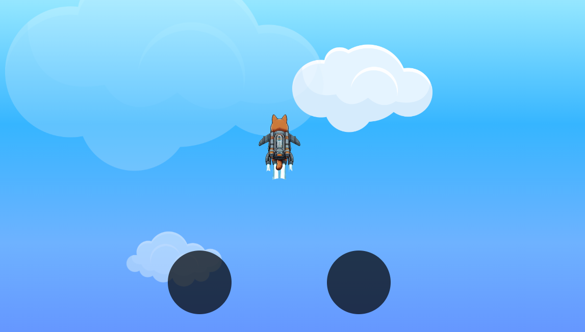

# Jogo do gatinho voador 😺🚀☁️

> Em construção 🛠️

* <a href="https://lucyanovidio.github.io/flying-cat/">Acesse aqui</a>

Em desenvolvimento um jogo do gatinho voador de mochila à jato, enfrentando obstáculos no céu, feito com javascript.

## 🛠 Tecnologias

    
    
    

 

 

---

<table>
  <tr>
    <td>
      
    </td>
    <td>
      Feito por <a href="https://github.com/lucyanovidio">Lucyan Ovídio.</a> 🙋🏿‍♂️
    </td>
  </tr>
</table>